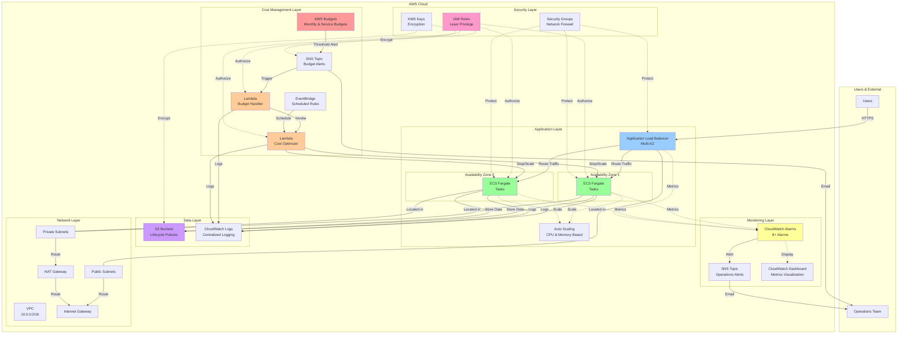
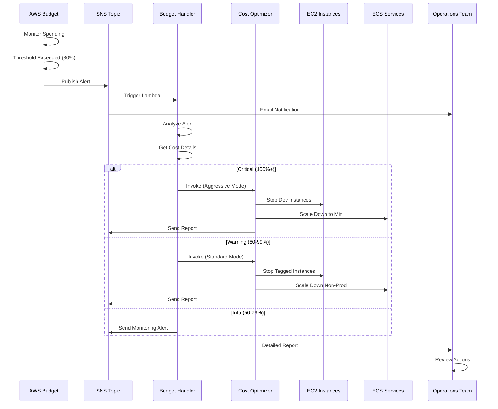
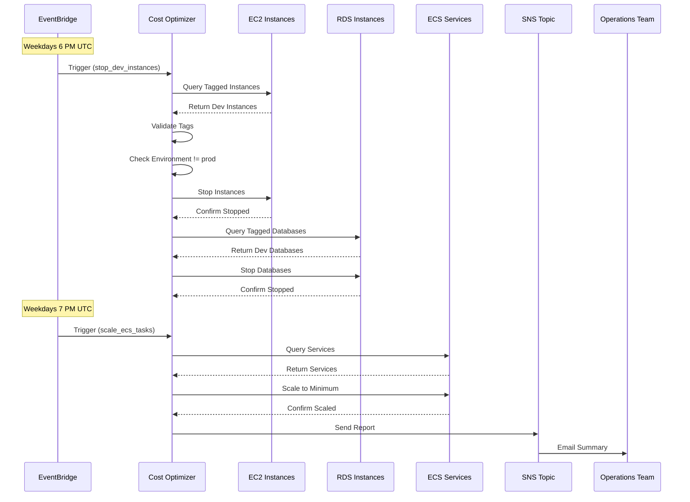
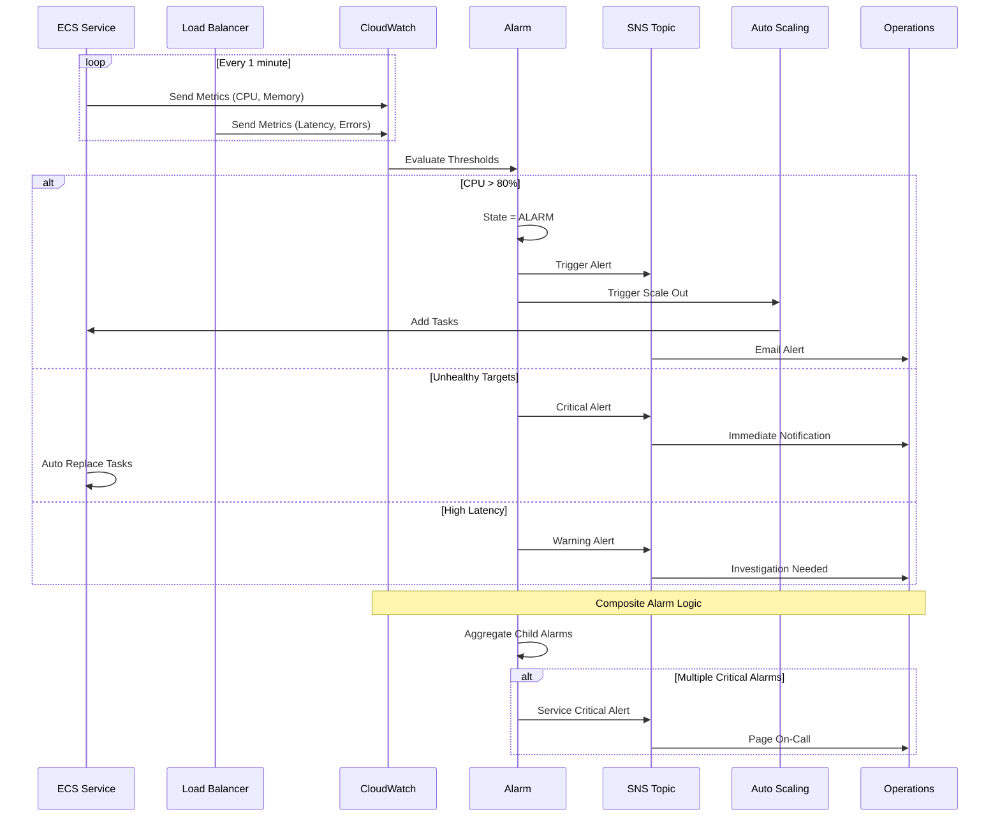
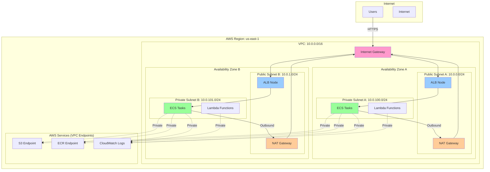
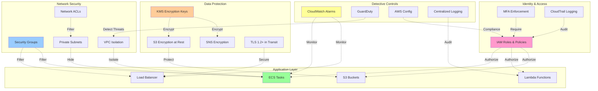
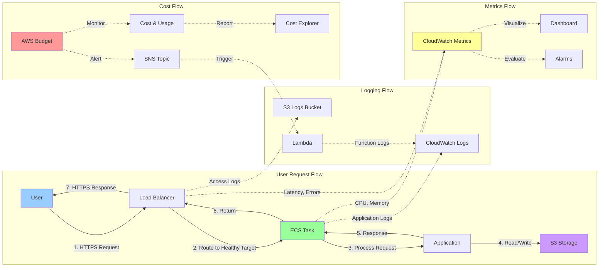
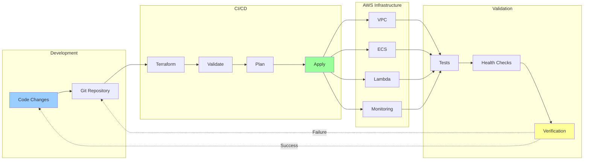
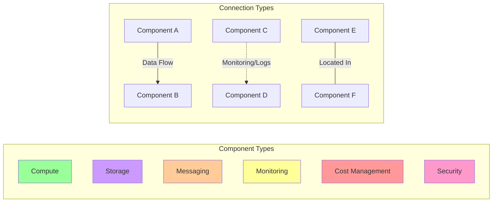

# AWS Cost Optimization & Reliability Platform - Architecture Diagrams

## High-Level Architecture



## Cost Optimization Flow



## Scheduled Cost Optimization



## Reliability & Monitoring Flow



## Network Architecture



## Security Architecture



## Data Flow Diagram



## Deployment Pipeline



## Legend



## How to View These Diagrams

### GitHub
These Mermaid diagrams render automatically on GitHub. Just view this file in your repository.

### VS Code
Install the "Markdown Preview Mermaid Support" extension.

### Online
Copy the Mermaid code to [Mermaid Live Editor](https://mermaid.live/)

### Export as Image
Use the Mermaid CLI or online editor to export as PNG/SVG:
```bash
npm install -g @mermaid-js/mermaid-cli
mmdc -i ARCHITECTURE_DIAGRAM.md -o architecture.png
```
